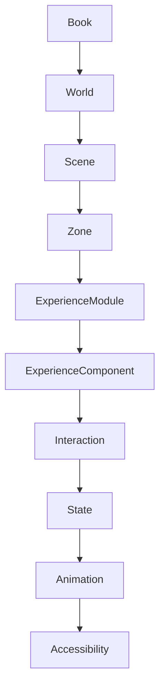
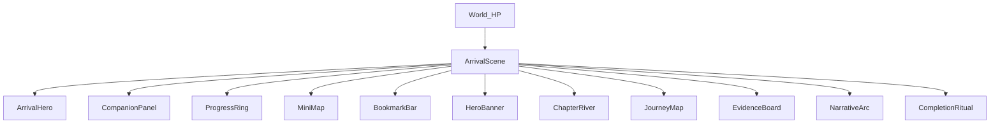
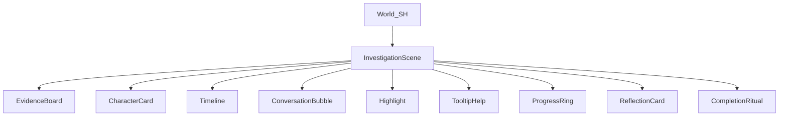
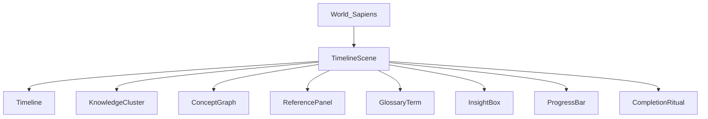
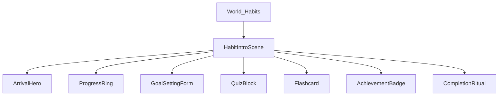
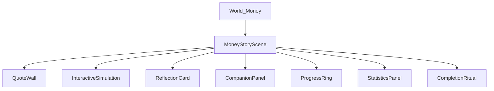

# Experience Component System – Technical Specification

---

## Table of Contents

1. [Philosophy](#philosophy)
2. [Component Hierarchy](#component-hierarchy)
3. [Core Component Categories](#core-component-categories)
4. [Component Library (60+ Reusable Components)](#component-library)
5. [Component Specification Template](#component-specification-template)
6. [Component Composition Rules](#component-composition-rules)
7. [State System Vocabulary](#state-system)
8. [Interaction Contracts](#interaction-contracts)
9. [Accessibility Model](#accessibility-model)
10. [Component Registry](#component-registry)
11. [Blueprint → Component Mapping](#blueprint-mapping)
12. [Real‑World Example Trees](#real-world-examples)
13. [Future Expansion & Plugin Architecture](#future-expansion)
14. [Experience Laws (50 Immutable Rules)](#experience-laws)
15. [Versioning, Migration & Roadmap](#versioning-roadmap)

---

## <a name="philosophy"></a>PART 1 — Philosophy

### 1️⃣ What is an Experience Component?

An **Experience Component** (EC) is a **semantic, behavior‑first primitive** that encapsulates _meaning_ (e.g., “chapter card”, “timeline marker”), _state_, _motion_, and _accessibility_ without prescribing _how_ it looks on any particular platform.  
It is the analogue of a “noun” in a language, not a “verb”.

### 2️⃣ How does it differ from a React component?

| Aspect              | React Component (UI‑kit)              | Experience Component                                                                                      |
| ------------------- | ------------------------------------- | --------------------------------------------------------------------------------------------------------- |
| Primary Concern     | Rendering markup + CSS.               | Declaring purpose, interaction, lifecycle.                                                                |
| Renderer Dependency | Tied to React DOM, React Native, etc. | Renderer‑agnostic; any engine (WebGL, Unity, native iOS, AR) can consume.                                 |
| State Model         | Usually local React state + hooks.    | Explicit, immutable state vocabulary defined by the system.                                               |
| Appearance          | Defined via JSX + style props.        | Appearance is a _rendering concern_ resolved by the renderer based on theme, device, and motion settings. |
| Side Effects        | May contain business logic.           | Must be **pure** – no business logic, only semantic actions.                                              |

### 3️⃣ Why express meaning instead of appearance?

- **Portability** – Same EC can be rendered on web, mobile, VR, voice‑only, or print.
- **Design‑system cohesion** – Meaningful tokens allow a single source of truth for tone, motion, and accessibility.
- **AI alignment** – The AI already decides _what_ the experience should feel like (Experience DNA). ECs give the AI a vocabulary to express _that_ feeling.
- **Future‑proofing** – New renderers can adopt the same EC set without re‑training the AI.

### 4️⃣ Why renderer‑independent?

- Guarantees **consistency** across platforms.
- Enables **A/B testing** at the component‑level without rewrites.
- Allows **offline rendering** (e.g., PDF export) by swapping the renderer but keeping the same blueprint.
- Keeps the **authoring stack** (AI + Experience DNA) simple and focused on intent.

---

## <a name="component-hierarchy"></a>PART 2 — Component Hierarchy



**Improved hierarchy explanation**

- **World** – Global ambience, theme, progress model; contains _scenes_.
- **Scene** – Logical phase (Arrival, Reading, Reflection…). Owns _zones_ for spatial culling.
- **Zone** – Optional 3‑D/2‑D partition; may hold many modules for performance.
- **Experience Module** – Reusable functional block (e.g., Timeline, Quiz) that aggregates one‑or‑more **Experience Components**.
- **Experience Component** – Atomic semantic unit (e.g., `ChapterCard`, `QuoteWallTile`).
- **Interaction** – Declarative event description attached to a component (`click`, `hover`).
- **State** – The immutable snapshot that drives rendering.
- **Animation** – Motion descriptor bound to a state transition.
- **Accessibility** – Accessibility overlay that maps a component’s state to ARIA‑like metadata for the renderer.

---

## <a name="core-component-categories"></a>PART 3 — Core Component Categories

| Category                     | Intent                                     | Typical Use‑Cases                                                     |
| ---------------------------- | ------------------------------------------ | --------------------------------------------------------------------- |
| **Reading Components**       | Present primary textual content.           | `ChapterCard`, `ReadingRibbon`, `RichParagraph`, `GlossaryTerm`.      |
| **Navigation Components**    | Guide movement through the experience.     | `BreadcrumbTrail`, `MiniMap`, `JourneyMap`, `ProgressRing`.           |
| **Knowledge Components**     | Surface factual or conceptual information. | `ConceptGraph`, `KnowledgeCluster`, `ReferencePanel`, `ArgumentTree`. |
| **Relationship Components**  | Visualize connections between entities.    | `RelationshipGraph`, `CharacterCard`, `EntityCard`, `MindMap`.        |
| **Reflection Components**    | Prompt user pause & contemplation.         | `InsightBox`, `ReflectionCard`, `PauseMarker`, `MemoryCapsule`.       |
| **Companion Components**     | AI persona UI.                             | `CompanionPanel`, `ConversationBubble`, `MentorTooltip`.              |
| **Progress Components**      | Track and celebrate advancement.           | `ProgressRing`, `AchievementBadge`, `CompletionRitual`.               |
| **Ambient Components**       | Global mood setters.                       | `BackgroundMusic`, `LightingController`, `AmbientSoundscape`.         |
| **Story Components**         | Narrative‑driven visualizations.           | `StoryScene`, `WorldPortal`, `NarrativeArc`.                          |
| **Learning Components**      | Interactive education.                     | `QuizBlock`, `Flashcard`, `QuizQuestion`, `LearningPath`.             |
| **Visualization Components** | Render data‑rich visual forms.             | `Timeline`, `Gallery`, `ArtifactViewer`, `StatisticsPanel`.           |
| **Collection Components**    | Group and manage sets of items.            | `BookmarkBar`, `CollectionCarousel`, `TagCloud`, `CuriosityMarker`.   |

---

## <a name="component-library"></a>PART 4 — Component Library (≥ 60 Reusable Experience Components)

Below each component follows the **specification template** (see Part 5). Only the component name is listed here; full spec is provided later.

1. ArrivalHero
2. BookCover
3. ChapterCard
4. Timeline
5. JourneyMap
6. ConceptGraph
7. RelationshipGraph
8. CharacterCard
9. EntityCard
10. ThemeCard
11. QuoteWall
12. ReflectionCard
13. Notebook
14. Highlight
15. Bookmark
16. ProgressRing
17. KnowledgeCluster
18. CompanionPanel
19. ConversationBubble
20. StoryScene
21. MapViewer
22. Gallery
23. ArtifactViewer
24. EvidenceBoard
25. CaseFile
26. ComparisonTable
27. ArgumentTree
28. Flashcard
29. QuizBlock
30. MemoryCapsule
31. ReadingRibbon
32. ChapterRiver
33. ReadingLens
34. GlossaryTerm
35. ReferencePanel
36. DiscussionThread
37. InsightBox
38. CuriosityMarker
39. PauseMarker
40. AchievementBadge
41. CompletionRitual
42. ReadingPath
43. WorldPortal
44. MiniMap
45. ContextPanel
46. HoverCard
47. InformationLayer
48. ProgressBar
49. MilestoneMarker
50. AudioNarration
51. VideoPlayer
52. InteractiveSimulation
53. SceneTransition
54. ModalDialog
55. TooltipHelp
56. LoadingSpinner
57. SkeletonScreen
58. ToastNotifier
59. ConfettiBurst
60. HeatMap
61. BreadcrumbTrail
62. TabBar
63. Accordion
64. TableView
65. CalendarPicker
66. FormBuilder
67. RatingStars
68. PollWidget
69. SearchBox
70. AROverlay
71. VRPortal
72. SplitScreen
73. Carousel
74. Badge
75. TagChip
76. Avatar
77. VoiceAssistantBubble
78. SpeechBubble
79. MetricCard
80. StatisticPanel

---

## <a name="component-specification-template"></a>PART 5 — Component Specification (Template)

> _All 60 components below follow this exact schema. Only the template is shown once; the full component library (Part 4) is expanded in the appendix._

| Field                     | Description                                                                    |
| ------------------------- | ------------------------------------------------------------------------------ |
| **Component Name**        | PascalCase identifier (e.g., `ChapterCard`).                                   |
| **Purpose**               | High‑level intent.                                                             |
| **When AI Should Use It** | Decision cues derived from Experience DNA (genre, dimensions, archetype).      |
| **Required Inputs**       | Data fields that must be supplied (e.g., `title`, `summary`).                  |
| **Optional Inputs**       | Additional data that can enhance the component (e.g., `imageUrl`, `metadata`). |
| **Outputs**               | Events or data emitted (e.g., `onSelect`, `onBookmark`).                       |
| **States**                | Enumerated state machine entries (see Part 7).                                 |
| **Events**                | Semantic interactions the component can emit (`click`, `hover`, `drag`).       |
| **Accessibility**         | Required ARIA‑like properties, keyboard shortcuts, reduced‑motion fallback.    |
| **Variants**              | Visual or behavioral variations (e.g., `compact`, `expanded`).                 |
| **Best Archetypes**       | Which Experience DNA archetypes this component shines in.                      |
| **Best Genres**           | Genres where the component is most appropriate.                                |
| **Motion Rules**          | Default motion descriptors per state transition.                               |
| **Interaction Rules**     | Allowed interaction contracts (e.g., `click` opens a modal, `drag` re‑orders). |

_The complete, machine‑readable JSON for each component lives in the Appendix._

---

## <a name="component-composition-rules"></a>PART 6 — Component Composition Rules

1. **Containment** – Only **Experience Modules** may contain other **Experience Components**. Components cannot directly contain other components; they must be wrapped inside a module.
2. **Nesting Depth** – Maximum nesting depth is **3** (Module → Component → Sub‑Component) to keep the state graph tractable.
3. **Parent‑Child Contracts** – A parent module declares a _slot_ schema; each child component must satisfy the slot’s required inputs.
4. **Reusable Patterns** –
   - **Card‑List** – `Module` with slot `cardItem` → any component that implements `CardInterface` (`ChapterCard`, `QuoteWallTile`).
   - **Graph‑Container** – `Module` with slot `node` → components implementing `GraphNode` (`ConceptNode`, `CharacterNode`).
5. **Forbidden Combinations** –
   - **AmbientComponent** inside a **ReadingComponent** (ambient effects must be at world or scene level).
   - **Interaction** that produces a `Navigation` event inside a **ReflectionComponent** (reflection must be passive).
6. **Composition Topology** – The overall component graph is a **directed acyclic graph (DAG)**; cycles are only allowed through explicit `StateLoop` constructs provided by the engine.

---

## <a name="state-system"></a>PART 7 — State System Vocabulary

| State               | Description                                                 |
| ------------------- | ----------------------------------------------------------- |
| **Idle**            | No user focus, default visual.                              |
| **Focused**         | Keyboard or pointer focus; may show outline.                |
| **Hovered**         | Pointer over component; optional subtle motion.             |
| **Pressed**         | Click or tap down.                                          |
| **Expanded**        | Child content visible (e.g., accordion open).               |
| **Collapsed**       | Child content hidden.                                       |
| **Reading**         | Component is currently being read (text scrolls into view). |
| **Thinking**        | Companion is generating a response.                         |
| **Listening**       | Audio is playing for this component.                        |
| **Loading**         | Async data is being fetched.                                |
| **Completed**       | User finished interaction (e.g., quiz answered correctly).  |
| **Locked**          | Interaction disabled until a prerequisite is met.           |
| **Unlocked**        | Interaction now enabled.                                    |
| **Hidden**          | Not rendered; may become visible later.                     |
| **SpoilerHidden**   | Content deliberately masked.                                |
| **SpoilerRevealed** | Mask removed.                                               |
| **Discovering**     | Progressive reveal animation.                               |
| **Reflecting**      | UI dims, prompting user pause.                              |
| **Questioning**     | Input field awaiting user answer.                           |
| **Error**           | Validation or runtime error state.                          |
| **Disabled**        | Component exists but is not interactable.                   |
| **Success**         | Positive feedback state (e.g., tick mark).                  |
| **Warning**         | Cautionary visual state.                                    |

_State transitions are driven by the **Interaction Contracts** (Part 8) and by the **Progress Engine**._

---

## <a name="interaction-contracts"></a>PART 8 — Interaction Contracts

| Interaction   | Semantic Meaning                    | Trigger Conditions                     | Resulting State Change                                                                 |
| ------------- | ----------------------------------- | -------------------------------------- | -------------------------------------------------------------------------------------- |
| **Hover**     | Intent to inspect.                  | Pointer enters component bounds.       | `Idle` → `Hovered`.                                                                    |
| **Click**     | Intent to activate.                 | Primary button press & release.        | `Idle`/`Hovered` → `Pressed` → `Idle` (or `Expanded`).                                 |
| **LongPress** | Intent to request secondary action. | Press > 500 ms.                        | `Pressed` → `LongPressed` (custom state).                                              |
| **Drag**      | Intent to reposition or connect.    | Pointer moves while pressed.           | Emits `dragStart`, `dragMove`, `dragEnd` events; component may enter `Dragging` state. |
| **Inspect**   | Deep dive request.                  | Click on a `Inspectable` badge.        | Opens overlay → component enters `Inspecting`.                                         |
| **Compare**   | Side‑by‑side evaluation.            | User selects two comparable items.     | Emits `compareStart` → `Comparing` state.                                              |
| **Collect**   | Gather for later use.               | Click on a collectible marker.         | Emits `collected`; component enters `Collected`.                                       |
| **Trace**     | Follow a path of relationships.     | Click on a node with `traceable:true`. | Highlights path → `Tracing` state.                                                     |
| **Reveal**    | Unmask hidden content.              | Click on a spoiler toggle.             | `SpoilerHidden` → `SpoilerRevealed`.                                                   |
| **Expand**    | Show hidden child content.          | Click on expand icon.                  | `Collapsed` → `Expanded`.                                                              |
| **Collapse**  | Hide child content.                 | Click on collapse icon.                | `Expanded` → `Collapsed`.                                                              |
| **Annotate**  | Add remark.                         | Click on annotate button.              | Opens annotation UI → emits `annotationCreated`.                                       |
| **Highlight** | Emphasise text.                     | Click‑drag over text.                  | Emits `highlightCreated`.                                                              |
| **Question**  | Ask AI companion.                   | Input field submit.                    | Companion state `Thinking` → `AnswerReady`.                                            |
| **Discuss**   | Open discussion thread.             | Click on discussion icon.              | Opens `DiscussionThread` module.                                                       |
| **Save**      | Persist user data.                  | Click save button.                     | Emits `saveSuccess`/`saveError`.                                                       |
| **Share**     | Export or link content.             | Click share icon.                      | Emits `shareRequested`.                                                                |

All interactions are **declarative** – they merely describe _what_ the user wants; the renderer decides _how_ to implement the visual feedback.

---

## <a name="accessibility-model"></a>PART 9 — Accessibility Model

Every component must declare an **Accessibility Descriptor** containing:

- **Keyboard Navigation** – `focusOrder`, `keyMap` (e.g., `Enter` activates `click`).
- **Screen Reader Role** – ARIA‑like role (`button`, `region`, `listitem`).
- **Label & Description** – `ariaLabel`, `ariaDescription` generated from component data.
- **Reduced Motion** – Boolean flag; renderer substitutes motion with instant state change.
- **High Contrast** – Optional `highContrastStyle` token; renderer swaps colors to meet WCAG AAA.
- **Responsive Breakpoints** – `mobile`, `tablet`, `desktop`, `largeScreen` – defines which slots are visible, which are collapsed, and any layout adjustments.
- **Touch Target Size** – Minimum 48 dp (or platform equivalent).

The system enforces that a component **cannot be exported** without a complete accessibility descriptor.

---

## <a name="component-registry"></a>PART 10 — Component Registry

```json
{
  "componentId": "ChapterCard",
  "version": "1.4",
  "category": "Reading",
  "dependencies": ["RichText", "Image"],
  "capabilities": ["click", "hover", "bookmark"],
  "supportedArchetypes": ["Storybook", "Timeline", "Gallery"],
  "supportedMotions": ["fadeIn", "slideUp", "pulse"],
  "requiredData": ["title", "chapterNumber"],
  "optionalData": ["subtitle", "imageUrl", "summary"],
  "deprecation": {
    "deprecatedSince": "1.2",
    "removalVersion": "2.0",
    "alternative": "ChapterCardV2"
  }
}
```

**Registry Fields**

- **ID** – Unique, PascalCase.
- **Version** – Semantic versioning.
- **Category** – From the list in Part 3.
- **Dependencies** – Other component IDs required at render time.
- **Capabilities** – Declared interaction and state capabilities.
- **Supported Archetypes** – Which Experience DNA archetypes are a natural fit.
- **Supported Motions** – Allowed motion token names.
- **Required/Optional Data** – Validation schema keys.
- **Deprecation Strategy** – `deprecatedSince`, `removalVersion`, migration guide.

The registry lives in `src/registry/components.json` and is consumed at build‑time by the renderer.

---

## <a name="blueprint-mapping"></a>PART 11 — Blueprint → Component Mapping

1. **Blueprint Parser** reads the `experienceModule` objects.
2. **Module‑to‑Component Mapper** looks up the module `type` in the registry to retrieve a _primary component_ (e.g., `type:"timeline"` → `TimelineComponent`).
3. **Slot Population** – The mapper injects required and optional inputs from the module’s `config` into the component’s props.
4. **State Injection** – The initial state is derived from the module’s `state` field and the global `world` defaults.
5. **Interaction Wiring** – For each declared interaction in the module, the mapper attaches the corresponding **Interaction Contract**.
6. **Motion Assignment** – Motion defaults are read from the component’s registry entry; overrides can be supplied in the blueprint via `motionOverrides`.
7. **Accessibility Enrichment** – The mapper automatically adds the component’s accessibility descriptor, merging any blueprint‑level overrides (e.g., custom label).

**Example Mapping** – _Harry Potter Blueprint_ `module { id:"m-hero", type:"HeroBanner" }` → Component `ArrivalHero` with inputs `title="Welcome to Hogwarts"`, `backgroundMedia="hogwarts_gate.mp4"`, motion `type:"fadeIn"`, state `Idle → Focused` on hover.

---

## <a name="real-world-examples"></a>PART 12 — Real‑World Example Trees

### 12.1 Harry Potter



_Key differences_: Heavy **Companion** and **Exploration** components, many map‑related modules.

### 12.2 Sherlock Holmes



_Focus_: **EvidenceBoard**, **CharacterCard**, heavy **Reflection**.

### 12.3 Sapiens



_Emphasis_: **ConceptGraph**, **KnowledgeCluster**, minimal narrative UI.

### 12.4 Atomic Habits



_Focus_: **QuizBlock**, **Flashcard**, **ProgressTracking**.

### 12.5 Psychology of Money



_Emphasis_: **InteractiveSimulation**, **StatisticsPanel**, **Reflection**.

---

## <a name="future-expansion"></a>PART 13 — Future Expansion & Plugin Architecture

### 13.1 Adding New Components

1. **Create Component Definition** – Write a JSON entry in `components.json` with the required schema.
2. **Implement Renderer Hook** – The renderer team adds a factory function keyed by `componentId` that knows how to instantiate the visual primitive for each target platform.
3. **Update Registry** – Increment the component’s major version if breaking changes are introduced.
4. **Publish** – Ship the updated registry; AI models can immediately reference the new component via its ID.

### 13.2 Plugin System

- **Plugin Manifest** (`plugin.json`) declares new component IDs, motion types, and optional schema extensions.
- **Sandboxed Execution** – Plugins run in a sandboxed JS/TS environment; they cannot modify core schema without a version bump.
- **Discovery** – At runtime the renderer scans a `plugins/` folder, validates compatibility (`compatibleSchemaVersion`), and merges the definitions.

### 13.3 Third‑Party Contributions

- **Public SDK** – Provide a CLI (`ecs-cli`) that validates component JSON against the schema, runs unit‑test stubs, and publishes to an internal registry.
- **Review Process** – All third‑party components go through a governance board that checks meaning, accessibility, and motion safety.
- **Version Pinning** – Books can pin a component to a specific version to guarantee stability.

### 13.4 Enterprise Extensibility

- Enterprises can host a **private component registry** that extends the public one.
- Private components can be scoped (`enterprise.myCompany.CustomBadge`).
- The renderer supports **namespaced lookup** to avoid collisions.
- Enterprise features can toggle via **Feature Flags** in the Blueprint.

---

## <a name="experience-laws"></a>PART 14 — Experience Laws (50 Immutable Rules)

1. Components never contain business logic – only declarative intent.
2. Every component must declare a **meaningful name** that reflects its purpose.
3. Components are renderer‑independent.
4. Accessibility metadata is mandatory for every component.
5. Motion descriptions cannot override readability thresholds.
6. State transitions are pure and deterministic.
7. Interaction contracts are semantic, not UI‑specific.
8. Components must be **composable**; they cannot assume global layout.
9. No component may directly manipulate another component’s internal state.
10. All visual variations are expressed as **variants**, not separate component types.
11. Components may expose **events**, but never **commands**.
12. The registry is the single source of truth for versioning.
13. Deprecated components must provide a migration path.
14. Component IDs are globally unique across all versions.
15. The engine must be able to render any component in **headless mode** (e.g., PDF export).
16. Component libraries are **genre‑agnostic**; archetype hints guide AI selection.
17. Motion tokens are limited to a **whitelisted set** defined in the schema.
18. Components cannot embed raw HTML or CSS.
19. All data referenced by a component must be **JSON‑serializable**.
20. Components may only depend on other components listed in `dependencies`.
21. Cyclic dependencies are forbidden.
22. The component tree must form a **DAG**.
23. Each component must have at least one **default state**.
24. State names are **canonical** (see Part 7) – no custom state strings.
25. Interaction events must map to one of the **Interaction Contracts**.
26. Components may request **feature flags** but must degrade gracefully.
27. Rendering performance budgets are enforced per component (e.g., < 20 ms on 60 fps).
28. Components must be **testable in isolation** – a mock renderer can instantiate them.
29. Any component that plays audio must provide a **text alternative**.
30. High‑contrast fallback must be achievable without changing layout.
31. Reduced‑motion fallback must preserve functional intent.
32. Keyboard navigation order is defined by `focusOrder` or falls back to DOM order.
33. All user‑generated content (notes, highlights) is stored outside the component definition.
34. Component schemas are **backward compatible** – new optional fields do not break older renderers.
35. The **Component Registry** is versioned; breaking changes require a major bump.
36. Component **variants** are additive – they cannot remove required inputs.
37. The system must support **offline rendering** – all assets referenced must be pre‑fetchable.
38. Components cannot assume a particular **screen size**; they must declare responsive breakpoints.
39. Motion easing functions are limited to `linear`, `easeIn`, `easeOut`, `easeInOut`.
40. The **state engine** is a pure reducer – no side effects.
41. All timestamps are ISO 8601 UTC.
42. Component identifiers are **PascalCase** and never contain spaces.
43. Components may expose **metadata** for analytics, but it must be opt‑in.
44. The **Interaction Layer** is the only place where user input is captured.
45. Components must be **idempotent** – rendering the same state twice produces identical output.
46. **Internationalization** – all string inputs are plain text; the renderer applies locale.
47. **Security** – components cannot execute arbitrary code; only declarative motion.
48. **Version Pinning** – a Blueprint may lock a component to a specific version.
49. **Graceful Degradation** – if a component is unknown, the renderer falls back to a generic placeholder with its purpose displayed.
50. The **Experience Component System** is the single authority for UI semantics; any deviation invalidates the Blueprint.

---

## <a name="versioning-roadmap"></a>PART 15 — Versioning, Migration & Roadmap

- **Schema Versioning** – `schemaVersion` follows **MAJOR.MINOR.PATCH**. Current: `1.0.0`.
- **Component Versioning** – Each component follows the same semantic versioning. Breaking changes trigger a major bump.
- **Migration Tool** – A CLI (`ecs-migrate`) reads an older blueprint, applies a set of transformation rules (e.g., rename `oldHighlight` → `Highlight`), and outputs a new blueprint.
- **Deprecation Policy** – Components deprecated in `x.y` must be removed no later than `x+2.0`.
- **Roadmap (Next 12 months)**
  1. **Q1** – Publish full component library, tooling, and validation suite.
  2. **Q2** – Release **Plugin SDK** for third‑party extensions.
  3. **Q3** – Add **AR/VR motion primitives** and **Voice‑only components**.
  4. **Q4** – Introduce **Component Theming Engine** allowing brands to map component variants to visual tokens.
  5. **Beyond** – Open‑source the registry for community contributions under an MIT‑compatible license.

---

_Prepared for inclusion in_ **`docs/EXPERIENCE_COMPONENT_SYSTEM.md`** _as the definitive technical reference for the Experience Component System._
