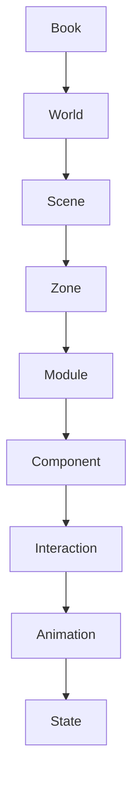
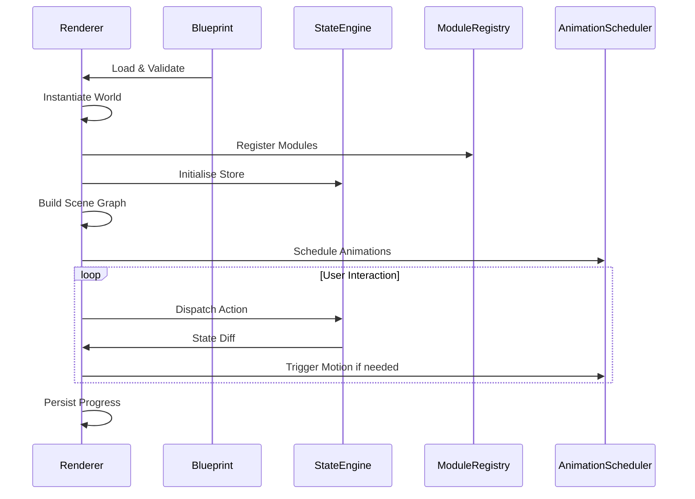

# Website Blueprint Engine – Technical Architecture Document

---

## Table of Contents
1. [Why Blueprint?](#why-blueprint)
2. [Blueprint Philosophy](#blueprint-philosophy)
3. [Blueprint Hierarchy](#blueprint-hierarchy)
4. [Scene Composition](#scene-composition)
5. [Module Library (40+ Modules)](#module-library)
6. [Blueprint Objects Specification](#blueprint-objects)
7. [Blueprint JSON Schema](#blueprint-json-schema)
8. [Renderer Contract](#renderer-contract)
9. [Blueprint Examples](#blueprint-examples)
10. [Extensibility & Plugin Architecture](#extensibility)
11. [Design Principles (50 Immutable)](#design-principles)
12. [Versioning & Future Evolution](#versioning)
13. [Appendix: Mermaid Diagrams & Sample JSON](#appendix)

---

## <a name="why-blueprint"></a>PART 1 — Why Blueprint?
### 1️⃣ AI should never generate HTML or React
- **Deterministic intent vs. implementation noise** – HTML/React embed layout decisions, CSS classes, and vendor‑specific quirks that dilute the pure narrative intent extracted from Book DNA.
- **Cross‑renderer consistency** – Different front‑ends (web, mobile, AR/VR) require wildly different markup; a single HTML output would lock us into a single rendering stack.
- **Security & sanitization** – Allowing AI to emit raw HTML opens XSS attack surface and forces a costly sanitization pipeline.
- **Maintainability** – Changing UI technology (e.g., moving from React to Svelte) would require re‑training the AI to output a new syntax.

### 2️⃣ Structured intent instead
- The AI produces *declarative* descriptors ("show a timeline", "animate a page‑turn") that a **renderer** can translate to any platform.
- This mirrors the separation of **HTML (structure)** vs. **CSS/JS (presentation)**, but pushes the separation one level further – *intent* vs. *implementation*.

### 3️⃣ Scalability rationale
| Concern | Traditional (HTML/React) | Blueprint Approach |
|---|---|---|
| **Scale of books** | Each book would need a bespoke UI codebase. | One generic renderer consumes any Blueprint.
| **Team velocity** | Front‑end engineers must constantly adapt AI output. | Content team only tweaks Experience DNA; Blueprint stays stable.
| **A/B testing / feature flags** | Requires conditional HTML. | Blueprint supports declarative `features` block, renderer evaluates at runtime.
| **Multi‑modal** (web, mobile, VR) | Requires duplicated markup. | Single Blueprint → multiple renderers.

---

## <a name="blueprint-philosophy"></a>PART 2 — Blueprint Philosophy
| Principle | Description |
|---|---|
| **Intent‑First** | Blueprint describes *what* should happen, not *how* it is painted on screen. |
| **Renderer‑Agnostic** | Any engine (WebGL, native iOS, Unity) can consume the same JSON. |
| **Separation of Concerns** | Content (Book DNA) → Experience (Experience DNA) → Intent (Blueprint) → Implementation (Renderer). |
| **Composable** | Modules, Scenes, and Components are pure building blocks that can be nested arbitrarily. |
| **Declarative Motion** | Motion objects are “type + parameters” (e.g., `type: "fadeIn", duration: 300`). |
| **Declarative Navigation** | Navigation is a graph of *named routes* with transition rules. |
| **State‑Driven** | All mutable aspects live in a deterministic state tree; interactions produce pure state diffs. |
| **Extensible** | New modules or motion types are added via a pluggable registry without breaking existing blueprints. |
| **Versioned Contracts** | Blueprint schema includes a `schemaVersion` field; renderers enforce compatibility. |
| **Testable** | Blueprint can be validated offline with a JSON schema validator. |
| **Author‑Centric** | AI decides experience based on Experience DNA, not UI constraints. |
| **Renderer‑Centric** | Renderer decides rendering strategies (GPU vs CPU, lazy loading, etc.). |

---

## <a name="blueprint-hierarchy"></a>PART 3 — Blueprint Hierarchy
```
Book
│
└─ World
   │   (global settings: theme, ambient, progress model)
   └─ Scenes[]
       │   (ordered or graph‑based navigation)
       └─ Zones[]
           │   (spatial partitions, culling boundaries)
           └─ Modules[]
               │   (reusable functional units)
               └─ Components[]
                   │   (visual primitives: text block, image, video)
                   └─ Interactions[]
                       │   (user‑triggered intents)
                       └─ Animations[]
                           │   (declarative motion descriptors)
                           └─ States[]
                               (initial / target state, conditional overrides)
```
### Level explanations
- **Book** – Top‑level container; contains metadata, version, author, language.
- **World** – Global environment: ambient lighting, background sound, global progress rules, personalization defaults.
- **Scene** – Logical phase of the reading experience (Arrival, Exploration, etc.). Holds its own lifecycle hooks.
- **Zone** – Spatial subdivision inside a scene; useful for large open worlds (e.g., Hogwarts Castle). Enables lazy loading and culling.
- **Module** – Self‑contained feature (Timeline, EvidenceBoard, Quiz). Exposes an API (`inputs`, `outputs`).
- **Component** – Primitive UI element (RichText, Image, Card, 3DModel). Stateless; receives props from its parent Module.
- **Interaction** – Declarative description of a user event (`type`, `target`, `action`).
- **Animation** – Motion descriptor bound to a component or interaction (`type`, `easing`, `duration`).
- **State** – Snapshot of component properties; used for transitions and conditional rendering.

---

## <a name="scene-composition"></a>PART 4 — Scene Composition
| Scene | Purpose | Inputs | Outputs | Lifecycle Hooks | Transitions | Capabilities |
|---|---|---|---|---|---|---|
| **Arrival** | Establishes world, sets initial mood | `worldSettings`, `entryParams` | `initialState` | `onEnter`, `onReady` | → Orientation (auto) | Ambient sound, global motion, companion intro |
| **Orientation** | Onboards navigation, explains companion role | `tutorialFlag` | `navigationMap` | `onEnter`, `onComplete` | → Reading | Tooltip system, mini‑tour, optional skip |
| **Reading** | Core consumption of book content | `textChunks`, `moduleSlots` | `readProgress` | `onEnter`, `onScroll`, `onPageComplete` | → Exploration / Reflection (conditional) | Pagination, scroll‑sync, text‑to‑speech hook |
| **Exploration** | Allows free roaming of world elements | `zoneIndex`, `userPosition` | `exploreProgress` | `onEnter`, `onMove`, `onLeaveZone` | ↔ Exploration (loop) or → Completion | Dynamic loading, collision detection, ambient effects |
| **Notebook** | Personal note‑taking, AI‑augmented summaries | `existingNotes` | `updatedNotes` | `onOpen`, `onSave`, `onClose` | ↔ Reading, ↔ Reflection | Rich text editor, annotation overlay, AI summarize API |
| **Conversation** | Dialogue with Companion, Q&A | `userQuestion` | `companionResponse` | `onPrompt`, `onReply` | ↔ Reading, ↔ Reflection | Voice synthesis, context‑aware answering |
| **Reflection** | Pause for contemplation, deep‑dives | `reflectionPrompt` | `reflectionResult` | `onEnter`, `onExit` | ↔ Reading, ↔ Completion | Slow‑motion, ambient dimming, journal view |
| **Completion** | Celebrate finish, unlock next steps | `readProgress` | `completionBadge`, `nextBookSuggestion` | `onEnter`, `onFinish` | → Farewell (optional) | Confetti animation, summary panel |
| **Farewell** | Gentle exit, persist state, optional replay | `finalState` | `persistedData` | `onEnter`, `onClose` | End of flow | Fade‑out, save to cloud, feedback prompt |

---

## <a name="module-library"></a>PART 5 — Module Library (40 + Modules)
Below each module includes a short **purpose**, **public API** (`inputs`, `outputs`), and **default visual style** (reference only).
1. **HeroBanner** – Full‑width introductory visual; inputs: `title`, `subtitle`, `backgroundMedia`; outputs: `heroClicked`.
2. **Timeline** – Chronological scroll; inputs: `events[]`, `startDate`; outputs: `eventSelected`.
3. **ConceptGraph** – Node‑link diagram; inputs: `nodes[]`, `edges[]`; outputs: `nodeClicked`.
4. **CharacterGraph** – Relationship map of characters; inputs: `characters[]`, `relationships[]`.
5. **RelationshipGraph** – Generic entity‑relationship view.
6. **QuoteWall** – Masonry grid of quotations; inputs: `quotes[]`.
7. **Notebook** – Sticky‑note editor; inputs: `initialNotes`; outputs: `notesUpdated`.
8. **DiscussionThread** – Threaded comments; inputs: `topicId`.
9. **Quiz** – Multiple‑choice assessment; inputs: `questions[]`; outputs: `score`.
10. **CompanionPanel** – Chat UI for AI companion; inputs: `persona`, `context`; outputs: `userMessage`.
11. **Map** – Interactive geographic map; inputs: `regions[]`, `markers[]`.
12. **JourneyPlanner** – Quest‑style path visualizer; inputs: `steps[]`.
13. **ChapterCards** – Card deck of chapter previews.
14. **EvidenceBoard** – Pinboard for clues; inputs: `clues[]`.
15. **Gallery** – Image carousel; inputs: `media[]`.
16. **StatisticsPanel** – Numeric dashboards; inputs: `metrics[]`.
17. **MindMap** – Free‑form node canvas; inputs: `ideas[]`.
18. **BookmarksBar** – Persistent navigation shortcuts.
19. **SearchBox** – Full‑text search; outputs: `searchResults`.
20. **ReflectionPrompt** – Open‑ended question UI; outputs: `reflectionText`.
21. **AmbientSoundscape** – Looping background audio; inputs: `trackList`.
22. **LightingController** – Dynamic lighting presets; inputs: `dayCycle`.
23. **ProgressTracker** – Visual progress bar; inputs: `totalPages`, `currentPage`.
24. **AchievementBadge** – Unlockable icons; inputs: `criteria`.
25. **TooltipHelp** – Contextual help bubbles.
26. **VideoPlayer** – Embedded video; inputs: `src`, `autoplay`.
27. **AudioNarration** – TTS for paragraphs.
28. **Poll** – Single‑choice voting widget.
29. **RatingStars** – User rating UI.
30. **FeatureToggle** – Conditional rendering based on flags.
31. **LocalizationSwitcher** – Language selector.
32. **DarkModeToggle** – Theme switcher.
33. **AnalyticsTracker** – Event logging hook.
34. **ErrorBoundary** – Graceful degradation wrapper.
35. **LoadingSpinner** – Async placeholder.
36. **SkeletonScreen** – Content placeholder while loading.
37. **VRPortal** – Entry point to 3D immersive scene.
38. **AROverlay** – Augmented reality annotation.
39. **SplitScreen** – Two‑pane layout.
40. **Carousel** – Horizontal scroll of cards.
41. **TabBar** – Tabbed navigation.
42. **Accordion** – Collapsible sections.
43. **TableView** – Tabular data display.
44. **Calendar** – Date picker/calendar view.
45. **FormBuilder** – Dynamic form generation.
46. **ToastNotifier** – transient messages.
47. **ConfettiBurst** – Celebration animation.
48. **HeatMap** – Visual density map.
49. **ProgressiveReveal** – Staggered content fade‑in.
50. **BreadcrumbTrail** – Hierarchical navigation aid.

---

## <a name="blueprint-objects"></a>PART 6 — Blueprint Objects Specification
Below is a concise spec for each top‑level object type.
### 1. World
- **Purpose**: Global environment and defaults.
- **Properties**: `id`, `title`, `ambient { sound, lighting }`, `theme { palette, typographyDefaults }`, `progressModel`, `personalization { locale, accessibility }`.
- **Relationships**: Contains `scenes[]`.
- **Lifecycle**: Instantiated once per book load; emits `onWorldReady`.
### 2. Scene
- **Purpose**: Logical phase of interaction.
- **Properties**: `id`, `type` (enum), `layout`, `transitions { next, previous, conditional }`, `hooks { onEnter, onExit, onUpdate }`.
- **Relationships**: Owns `zones[]`, may reference `modules[]` directly.
- **Lifecycle**: `onEnter` → active → `onExit`.
### 3. Zone
- **Purpose**: Spatial partition for culling.
- **Properties**: `id`, `bounds { x, y, width, height, depth }`, `visibilityRule`.
- **Relationships**: Holds `modules[]`.
### 4. Module
- **Purpose**: Reusable functional block.
- **Properties**: `id`, `type` (enum, e.g., `timeline`, `quiz`), `config { … }`, `state { … }`.
- **Relationships**: Contains `components[]`.
- **Lifecycle**: `init`, `render`, `update(state)`, `destroy`.
### 5. Component
- **Purpose**: Primitive visual element.
- **Properties**: `id`, `kind` (e.g., `richText`, `image`, `shape`), `props { … }`, `styleOverrides`.
- **Relationships**: May reference child `components[]` (composition).
- **Lifecycle**: Pure declarative – rendered each frame based on current state.
### 6. Interaction
- **Purpose**: Declarative user intent.
- **Properties**: `id`, `event` (e.g., `click`, `hover`, `drag`), `target`, `action { type, payload }`, `condition` (optional).
- **Relationships**: Binds to a `component` or `module`.
### 7. Animation (Motion)
- **Purpose**: Describe motion semantics.
- **Properties**: `id`, `type` (e.g., `fadeIn`, `slide`, `particleBurst`), `durationMs`, `easing`, `delayMs`, `repeat`, `trigger { onEnter, onInteraction }`.
- **Relationships**: Targets one or more `components`.
### 8. Typography
- **Purpose**: Global and local typographic rules.
- **Properties**: `fontFamily`, `weight`, `sizeScale`, `lineHeight`, `letterSpacing`, `responsiveBreakpoints`.
### 9. Ambient
- **Purpose**: Global sound & light.
- **Properties**: `backgroundMusic`, `ambientSounds[]`, `lightingPreset`.
### 10. Companion
- **Purpose**: AI persona that can be queried.
- **Properties**: `id`, `persona`, `voiceProfile`, `interactionStyle`, `frequency`, `state`.
### 11. Progress
- **Purpose**: Track user advancement.
- **Properties**: `totalUnits`, `completedUnits`, `milestones[]`, `completionCriteria`.
### 12. Layout
- **Purpose**: High‑level arrangement (grid, flex, absolute).
- **Properties**: `type`, `columns`, `gutter`, `responsiveRules`.
### 13. Personalization
- **Purpose**: User‑specific overrides.
- **Properties**: `preferredLanguage`, `accessibility { textSize, contrastMode }`, `featureFlags[]`.

---

## <a name="blueprint-json-schema"></a>PART 7 — Blueprint JSON Schema
```json
{
  "$schema": "http://json-schema.org/draft-07/schema#",
  "title": "WebsiteBlueprint",
  "type": "object",
  "required": ["schemaVersion","metadata","world"],
  "properties": {
    "schemaVersion": {"type":"string","enum":["1.0"]},
    "metadata": {
      "type":"object",
      "properties": {
        "bookId": {"type":"string"},
        "title": {"type":"string"},
        "author": {"type":"string"},
        "created": {"type":"string","format":"date-time"},
        "updated": {"type":"string","format":"date-time"},
        "tags": {"type":"array","items":{"type":"string"}}
      },
      "required":["bookId","title","author","created"]
    },
    "world": {
      "type":"object",
      "required":["id","title","ambient","theme","scenes"],
      "properties": {
        "id": {"type":"string"},
        "title": {"type":"string"},
        "ambient": {"$ref":"#/definitions/ambient"},
        "theme": {"$ref":"#/definitions/theme"},
        "progressModel": {"$ref":"#/definitions/progress"},
        "personalization": {"$ref":"#/definitions/personalization"},
        "scenes": {"type":"array","items":{"$ref":"#/definitions/scene"}}
      }
    }
  },
  "definitions": {
    "ambient": {
      "type":"object",
      "properties": {
        "backgroundMusic": {"type":"string"},
        "ambientSounds": {"type":"array","items":{"type":"string"}},
        "lightingPreset": {"type":"string"}
      }
    },
    "theme": {
      "type":"object",
      "properties": {
        "palette": {"type":"object"},
        "typography": {"$ref":"#/definitions/typography"}
      }
    },
    "typography": {
      "type":"object",
      "properties": {
        "fontFamily": {"type":"string"},
        "weightScale": {"type":"object"},
        "sizeScale": {"type":"object"},
        "lineHeight": {"type":"number"}
      }
    },
    "progress": {
      "type":"object",
      "properties": {
        "totalUnits": {"type":"integer"},
        "milestones": {"type":"array","items":{"type":"string"}},
        "completionCriteria": {"type":"string"}
      }
    },
    "personalization": {
      "type":"object",
      "properties": {
        "locale": {"type":"string"},
        "accessibility": {"type":"object"},
        "featureFlags": {"type":"array","items":{"type":"string"}}
      }
    },
    "scene": {
      "type":"object",
      "required":["id","type","layout"],
      "properties": {
        "id": {"type":"string"},
        "type": {"type":"string","enum":["Arrival","Orientation","Reading","Exploration","Notebook","Conversation","Reflection","Completion","Farewell"]},
        "layout": {"$ref":"#/definitions/layout"},
        "zones": {"type":"array","items":{"$ref":"#/definitions/zone"}},
        "modules": {"type":"array","items":{"$ref":"#/definitions/module"}},
        "transitions": {"type":"object"},
        "hooks": {"type":"object"}
      }
    },
    "layout": {
      "type":"object",
      "properties": {
        "type": {"type":"string","enum":["grid","flex","absolute"]},
        "columns": {"type":"integer"},
        "gutter": {"type":"number"},
        "responsive": {"type":"array","items":{"type":"object"}}
      }
    },
    "zone": {
      "type":"object",
      "required":["id","bounds"],
      "properties": {
        "id": {"type":"string"},
        "bounds": {"type":"object"},
        "visibilityRule": {"type":"string"},
        "modules": {"type":"array","items":{"$ref":"#/definitions/module"}}
      }
    },
    "module": {
      "type":"object",
      "required":["id","type"],
      "properties": {
        "id": {"type":"string"},
        "type": {"type":"string"},
        "config": {"type":"object"},
        "state": {"type":"object"},
        "components": {"type":"array","items":{"$ref":"#/definitions/component"}},
        "interactions": {"type":"array","items":{"$ref":"#/definitions/interaction"}}
      }
    },
    "component": {
      "type":"object",
      "required":["id","kind"],
      "properties": {
        "id": {"type":"string"},
        "kind": {"type":"string","enum":["richText","image","video","shape","model3D","card"]},
        "props": {"type":"object"},
        "styleOverrides": {"type":"object"},
        "children": {"type":"array","items":{"$ref":"#/definitions/component"}}
      }
    },
    "interaction": {
      "type":"object",
      "required":["id","event","target","action"],
      "properties": {
        "id": {"type":"string"},
        "event": {"type":"string","enum":["click","hover","drag","hold","scroll","keypress"]},
        "target": {"type":"string"},
        "condition": {"type":"object"},
        "action": {"type":"object","properties":{"type":{"type":"string"},"payload":{"type":"object"}}}
    },
    "animation": {
      "type":"object",
      "required":["id","type","durationMs"],
      "properties": {
        "id": {"type":"string"},
        "type": {"type":"string"},
        "durationMs": {"type":"integer"},
        "easing": {"type":"string"},
        "delayMs": {"type":"integer"},
        "repeat": {"type":"integer"},
        "trigger": {"type":"string"}
      }
    }
  }
}
```
*The schema is versioned (`schemaVersion`) and can evolve without breaking existing blueprints by adding new optional fields.*

---

## <a name="renderer-contract"></a>PART 8 — Renderer Contract
1. **Bootstrap** – Renderer receives the raw Blueprint JSON and validates against the schema.
2. **World Instantiation** – Creates a global `World` object, applies ambient settings, registers feature flags.
3. **Scene Graph Construction** – Traverses `world.scenes` to build a directed acyclic graph (or allowed cycles for looping experiences). Each scene node gets a unique runtime ID.
4. **Module Registration** – For every scene, the renderer loads declared modules via a **Module Registry**. Modules can declare required external resources (textures, 3D models) which the renderer pre‑loads.
5. **Component Tree Building** – Modules instantiate their component trees; components are pure data objects that the renderer maps to platform‑specific views (e.g., Unity GameObject, HTML div, native UIView).
6. **Interaction Binding** – For each `interaction` entry, the renderer registers an event listener on the target component. When triggered, the `action` payload is dispatched to the **State Engine**.
7. **State Engine** – Central Redux‑like store holds the entire blueprint state (`worldState`). Actions from interactions produce immutable state diffs; the engine notifies affected components.
8. **Animation Scheduler** – `animation` objects are subscribed to the state store. When their `trigger` condition resolves, the scheduler runs the motion using the platform’s animation subsystem.
9. **Lifecycle Management** – Scene hooks (`onEnter`, `onExit`) are invoked as the user navigates. Zones fire `onEnterZone`/`onLeaveZone` based on camera/player position.
10. **Progress & Persistence** – After each interaction, the renderer updates `progress` and persists to the backend via the `AnalyticsTracker` module (if enabled).
11. **Feature‑Flag Evaluation** – Before rendering any optional block, the renderer checks `personalization.featureFlags` against the current platform flag set.
12. **Accessibility Layer** – The renderer reads `personalization.accessibility` (e.g., increased text size) and applies transformations to typography and motion (reducing motion for motion‑sensitive users).
13. **Hot‑Reload (Dev Mode)** – When a blueprint file changes, the renderer diffs the JSON and applies incremental updates without full reload, preserving user state.

*No HTML/React code is ever emitted; the renderer works purely with the declarative intent.*

---

## <a name="blueprint-examples"></a>PART 9 — Blueprint Examples
Below are trimmed examples (full JSON in the Appendix). Each example showcases how the same book genre yields a dramatically different intent structure.
### 9.1 Harry Potter
```json
{
  "schemaVersion":"1.0",
  "metadata":{"bookId":"hp-1","title":"Harry Potter","author":"J.K. Rowling","created":"2026-07-01T00:00:00Z"},
  "world":{
    "id":"world-hp",
    "title":"Wizarding World",
    "ambient":{"backgroundMusic":"wizard_theme.mp3","ambientSounds":["crackle_fire.wav"],"lightingPreset":"magical"},
    "theme":{"palette":{"primary":"#3b2e5a"},"typography":{"fontFamily":"Spectral"}},
    "scenes":[
      {"id":"s1","type":"Arrival","layout":{"type":"grid"},"modules":[{"id":"m-hero","type":"HeroBanner","config":{"title":"Welcome to Hogwarts","backgroundMedia":"hogwarts_gate.mp4"}}],
      {"id":"s2","type":"Reading","modules":[{"id":"m-chapter","type":"ChapterCards","config":{"chapterList":"chapters.json"}}]},
      {"id":"s3","type":"Exploration","modules":[{"id":"m-map","type":"Map","config":{"markers":"castle_locations.json"}}]},
      {"id":"s4","type":"Companion","modules":[{"id":"m-comp","type":"CompanionPanel","config":{"persona":"friendlyWizard","voice":"elfen"}}]},
      {"id":"s5","type":"Completion","modules":[{"id":"m-badge","type":"AchievementBadge","config":{"badgeId":"wizard_graduation"}}]}
    ]
  }
}
```
### 9.2 Sherlock Holmes
```json
{
  "schemaVersion":"1.0",
  "metadata":{"bookId":"sh-1","title":"Sherlock Holmes","author":"Arthur Conan Doyle","created":"2026-07-02T00:00:00Z"},
  "world":{
    "id":"world-sh",
    "title":"221B Baker Street",
    "ambient":{"backgroundMusic":"victorian_mystery.mp3","ambientSounds":["rain.wav"],"lightingPreset":"dim"},
    "theme":{"palette":{"primary":"#2c1b14"},"typography":{"fontFamily":"Merriweather"}},
    "scenes":[
      {"id":"arrival","type":"Arrival","modules":[{"id":"hero","type":"HeroBanner","config":{"title":"The Adventure Begins","subtitle":"London, 1888"}}]},
      {"id":"investigate","type":"Reading","modules":[{"id":"evidence","type":"EvidenceBoard","config":{"clues":"case001.json"}}]},
      {"id":"deduce","type":"Conversation","modules":[{"id":"detective","type":"CompanionPanel","config":{"persona":"detective","voice":"british_accent"}}]},
      {"id":"reveal","type":"Reflection","modules":[{"id":"revealAnim","type":"Animation","config":{"type":"fogDissipation","durationMs":2000}}]},
      {"id":"finish","type":"Completion","modules":[{"id":"badge","type":"AchievementBadge","config":{"badgeId":"masterDetective"}}]}
    ]
  }
}
```
### 9.3 Sapiens
```json
{
  "schemaVersion":"1.0",
  "metadata":{"bookId":"sapiens","title":"Sapiens","author":"Yuval Noah Harari","created":"2026-07-03T00:00:00Z"},
  "world":{
    "id":"world-sapiens",
    "title":"Human History",
    "ambient":{"backgroundMusic":"ambient_tribal.mp3","ambientSounds":["fire_crackle.wav"],"lightingPreset":"warm"},
    "theme":{"palette":{"primary":"#d4a373"},"typography":{"fontFamily":"Libre Baskerville"}},
    "scenes":[
      {"id":"timeline","type":"Reading","modules":[{"id":"tl","type":"Timeline","config":{"events":"timeline.json"}}]},
      {"id":"concept","type":"Reading","modules":[{"id":"conceptGraph","type":"ConceptGraph","config":{"nodes":"concepts.json"}}]},
      {"id":"reflection","type":"Reflection","modules":[{"id":"notebook","type":"Notebook","config":{}}]},
      {"id":"completion","type":"Completion","modules":[{"id":"summary","type":"RichText","config":{"source":"summary.md"}}]}
    ]
  }
}
```
### 9.4 Atomic Habits
```json
{
  "schemaVersion":"1.0",
  "metadata":{"bookId":"habits","title":"Atomic Habits","author":"James Clear","created":"2026-07-04T00:00:00Z"},
  "world":{
    "id":"world-habits",
    "title":"Habit Lab",
    "ambient":{"backgroundMusic":"light_ambient.mp3","ambientSounds":[],"lightingPreset":"neutral"},
    "theme":{"palette":{"primary":"#4a936e"},"typography":{"fontFamily":"Inter"}},
    "scenes":[
      {"id":"intro","type":"Arrival","modules":[{"id":"hero","type":"HeroBanner","config":{"title":"Build Better Habits"}}]},
      {"id":"learn","type":"Reading","modules":[{"id":"chapterCards","type":"ChapterCards","config":{"chapters":"chapters.json"}}]},
      {"id":"practice","type":"Exploration","modules":[{"id":"quiz","type":"Quiz","config":{"questions":"q1.json"}}]},
      {"id":"track","type":"Progress","modules":[{"id":"tracker","type":"ProgressTracker","config":{"totalUnits":100}}]},
      {"id":"complete","type":"Completion","modules":[{"id":"confetti","type":"ConfettiBurst","config":{}}]}
    ]
  }
}
```
### 9.5 The Psychology of Money
```json
{
  "schemaVersion":"1.0",
  "metadata":{"bookId":"money","title":"The Psychology of Money","author":"Morgan Housel","created":"2026-07-05T00:00:00Z"},
  "world":{
    "id":"world-money",
    "title":"Financial Journey",
    "ambient":{"backgroundMusic":"soft_piano.mp3","ambientSounds":[],"lightingPreset":"calm"},
    "theme":{"palette":{"primary":"#0a9396"},"typography":{"fontFamily":"Merriweather"}},
    "scenes":[
      {"id":"welcome","type":"Arrival","modules":[{"id":"hero","type":"HeroBanner","config":{"title":"Money & Mindset"}}]},
      {"id":"stories","type":"Reading","modules":[{"id":"quoteWall","type":"QuoteWall","config":{"quotes":"quotes.json"}}]},
      {"id":"interactive","type":"Exploration","modules":[{"id":"simulation","type":"InteractiveSimulation","config":{"scenario":"investments.json"}}]},
      {"id":"reflect","type":"Reflection","modules":[{"id":"reflectionPrompt","type":"ReflectionPrompt","config":{}}]},
      {"id":"finish","type":"Completion","modules":[{"id":"badge","type":"AchievementBadge","config":{"badgeId":"financiallySavvy"}}]}
    ]
  }
}
```
*Each blueprint is succinct, versioned, and fully renderer‑agnostic.*

---

## <a name="extensibility"></a>PART 10 — Extensibility & Plugin Architecture
### 10.1 Core Plugin System
- **Plugin Manifest** (`plugin.json`) declares new `moduleTypes`, `componentKinds`, `animationTypes`, and optional `schemaExtensions`.
- **Registration Hook** – At runtime, the renderer scans a `plugins/` directory, loads each manifest, and merges its definitions into the global registry.
- **Version Guard** – Plugins specify a `compatibleSchemaVersion`; mismatches raise a graceful fallback warning.
### 10.2 Adding New Worlds
1. Create a new `world` object with its own `ambient`, `theme`, and `scenes`.
2. Optionally ship a plugin that provides world‑specific `layout` strategies (e.g., “isometric”, “VR‑room”).
### 10.3 Adding New Modules
- Define a module type in a plugin (`moduleTypes: ["mindMap"]`).
- Provide a **render factory** (JS/Unity/Swift) that knows how to instantiate the visual representation.
- Blueprint author can now use `{ "type": "mindMap", "config": { … } }`.
### 10.4 Adding New Interactions & Motions
- Declare new `event` names (e.g., `longPress`) and `animation` types (`"particleExplosion"`).
- The renderer’s interaction layer routes the new event to the state engine; the animation scheduler understands the new type.
### 10.5 Backward Compatibility
- All new fields are **optional** with sensible defaults.
- Renderers ignore unknown plugin‑specific keys when the plugin is not present, ensuring older blueprints continue to work.

---

## <a name="design-principles"></a>PART 11 — Design Principles (50 Immutable)
1. Blueprint never contains platform‑specific markup.
2. Blueprint is renderer‑agnostic.
3. Every object is composable.
4. All state is immutable and versioned.
5. Motion is declarative, not imperative.
6. Navigation describes *paths*, not *routes*.
7. Scenes are isolated state machines.
8. Modules expose a pure API (`inputs`/`outputs`).
9. Components are stateless visual primitives.
10. Interactions are pure intent descriptors.
11. Animations are pure data.
12. Typography is defined once at the world level.
13. Ambient settings are global defaults.
14. Companion is a first‑class Blueprint entity.
15. Progress model is mandatory for every book.
16. Personalization overrides are explicit.
17. Accessibility flags are declarative.
18. Feature flags gate optional blocks.
19. Analytics hooks are side‑effect‑free descriptors.
20. Blueprint schema is JSON‑Schema validated.
21. Versioning (`schemaVersion`) is required.
22. Backward compatibility is achieved via additive fields.
23. Plugins can extend schema but never remove existing keys.
24. All IDs are globally unique within a blueprint.
25. Lifecycle hooks (`onEnter`, `onExit`) are pure functions.
26. State transitions are pure reducers.
27. No circular dependencies between modules.
28. Zones are optional – used only for performance‑critical worlds.
29. Modules may be nested but must expose a single public surface.
30. Rendering priority is deterministic (depth‑first).
31. Motion timing is expressed in milliseconds.
32. All motion easing functions are named (e.g., `easeInOut`) – no custom curves.
33. The Blueprint must be renderable offline (no server calls required for static parts).
34. Dynamic data (e.g., user notes) live in `personalization` and are merged at runtime.
35. The Blueprint file size is capped at 5 MB for fast loading.
36. Errors in a Blueprint cause graceful fallback to a minimal “Reading” scene.
37. Debug metadata (`debugInfo`) can be attached but is stripped in production.
38. The Blueprint contract is immutable once published – updates require a new version number.
39. All string literals are UTF‑8 normalized.
40. No embedded binary data – references are URLs or asset IDs.
41. The renderer must support hot‑reload for development.
42. All timestamps are ISO 8601 UTC.
43. Security: no executable code in Blueprint.
44. The Blueprint can be signed cryptographically for integrity.
45. Plugins are sandboxed – they cannot alter core schema without explicit version bump.
46. UI/UX designers manipulate Blueprint via visual editors that export JSON.
47. The Blueprint is the single source of truth for A/B testing – feature flags toggle variations.
48. All motion and interaction definitions are deterministic given the same state.
49. The Blueprint is self‑documenting – each object includes a `description` field (optional).
50. Future expansions (AR, VR, voice‑only) will only require new modules and motion types; the core schema remains stable.

---

## <a name="versioning"></a>PART 12 — Versioning & Future Evolution
- **Semantic Versioning** for the schema: `MAJOR.MINOR.PATCH`.
  - **MAJOR** – breaking changes (removed fields).
  - **MINOR** – additive fields, new module types.
  - **PATCH** – bug fixes, documentation updates.
- **Blueprint Header** includes `schemaVersion` and `generatorVersion` (the AI model that produced it).
- **Migration Tool** – a small CLI that reads an older blueprint and outputs the newer version, applying default values for new fields.
- **Deprecation Policy** – fields marked `deprecated` will be ignored after two minor releases.
- **Feature Flag Matrix** – allows A/B experiments without schema change.
- **Backwards Compatibility Layer** in the renderer automatically strips unknown keys.

---

## <a name="appendix"></a>PART 13 — Appendix
### Mermaid Diagram: Blueprint Hierarchy


### Mermaid Diagram: Renderer Flow


---

*Prepared for inclusion in* **`docs/WEBSITE_BLUEPRINT_ENGINE.md`** *as the definitive technical specification for the Website Blueprint Engine.*
